# FinStream Data Platform

> An end-to-end Financial Data Engineering and AI platform built using AWS S3, Databricks, Apache Kafka, dbt, Apache Airflow, Machine Learning, and Generative AI.

---

## 📌 Overview

**FinStream** is an end-to-end financial data platform designed to simulate a production-oriented fintech data pipeline.

The platform supports both **batch and streaming data pipelines** and follows a layered data architecture:

```text
Data Sources
     ↓
AWS S3 / Apache Kafka
     ↓
Databricks
     ↓
Bronze
     ↓
Silver
     ↓
dbt Staging
     ↓
dbt Marts / Gold
     ↓
Analytics + AI
```

The platform contains **two independent AI layers**:

### AI Layer 1 — Natural Language → SQL

Allows users to ask questions about financial data using natural language and converts those questions into SQL queries that can be executed against the Gold analytical layer.

### AI Layer 2 — AI Incident Summarizer

Uses anomaly-detection results and data-quality information to generate human-readable explanations of detected incidents and stores the generated incident information in the AI layer.

---

# 🏗️ System Architecture

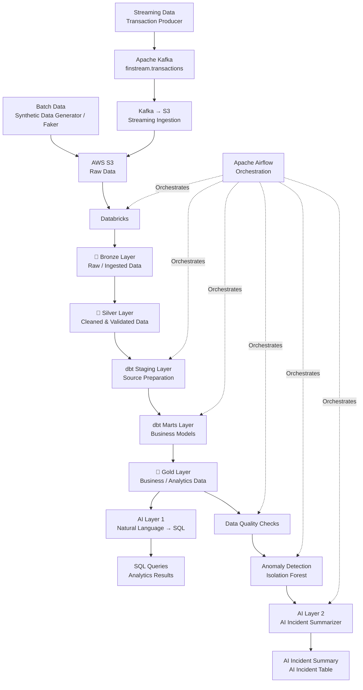

---

# 🔄 End-to-End Data Flow

```mermaid
flowchart LR

    BATCH["Synthetic Batch Data"]

    STREAM["Streaming Transactions"]

    S3["AWS S3"]

    KAFKA["Apache Kafka"]

    KAFKAS3["Kafka → S3"]

    DATABRICKS["Databricks"]

    BRONZE["🥉 Bronze"]

    SILVER["🥈 Silver"]

    STAGING["dbt Staging"]

    MARTS["dbt Marts / Gold"]

    AI1["AI Layer 1<br/>Natural Language → SQL"]

    ANALYTICS["Analytics Results"]

    QUALITY["Data Quality"]

    ANOMALY["Anomaly Detection"]

    AI2["AI Layer 2<br/>AI Incident Summarizer"]

    INCIDENT["AI Incident Table"]

    BATCH --> S3

    STREAM --> KAFKA

    KAFKA --> KAFKAS3

    KAFKAS3 --> S3

    S3 --> DATABRICKS

    DATABRICKS --> BRONZE

    BRONZE --> SILVER

    SILVER --> STAGING

    STAGING --> MARTS

    MARTS --> AI1

    AI1 --> ANALYTICS

    MARTS --> QUALITY

    QUALITY --> ANOMALY

    ANOMALY --> AI2

    AI2 --> INCIDENT
```

---

# 📊 Data Architecture

FinStream follows a Medallion-style architecture extended with dbt transformation layers.

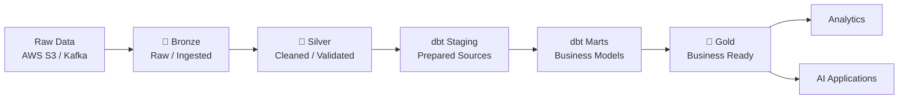

---

# 🥉 Bronze Layer

The Bronze layer contains raw or minimally transformed financial data.

### Data Sources

- Customers
- Accounts
- Merchants
- Transactions
- Transaction Events
- Exchange Rates
- Streaming Transactions

### Responsibilities

- Preserve source data
- Maintain raw history
- Capture ingestion metadata
- Preserve source information
- Support reprocessing
- Provide a reliable ingestion layer

---

# 🥈 Silver Layer

The Silver layer contains cleaned, standardized, and validated data.

### Processing

- Data type standardization
- Duplicate detection and removal
- Null handling
- Data validation
- Business-rule validation
- Relationship validation
- Transaction attribute standardization

### Purpose

The Silver layer provides reliable datasets for dbt transformations and downstream analytics.

---

# 📓 Databricks Notebooks

The Databricks processing layer contains **four notebooks**.

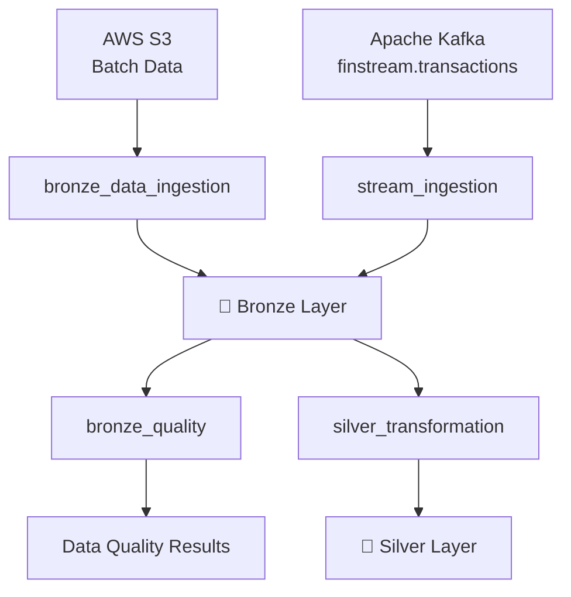

## 1. `bronze_data_ingestion`

Responsible for **batch ingestion** from AWS S3 into the Bronze layer.

```text
AWS S3
   ↓
bronze_data_ingestion
   ↓
🥉 Bronze
```

### Responsibilities

- Read raw Parquet files from S3
- Ingest source datasets
- Add ingestion metadata
- Preserve source information
- Create Bronze datasets

---

## 2. `stream_ingestion`

Responsible for processing transaction data from Apache Kafka.

```text
Apache Kafka
     ↓
finstream.transactions
     ↓
stream_ingestion
     ↓
AWS S3
     ↓
🥉 Bronze
```

### Responsibilities

- Consume Kafka transaction messages
- Process streaming transaction data
- Write streaming data to S3
- Make streaming data available to the Bronze layer

### Kafka Topic

```text
finstream.transactions
```

### Streaming S3 Location

```text
s3://finstream-data-ingestion/raw/stream_transactions/
```

---

## 3. `bronze_quality`

Responsible for performing **data-quality checks on Bronze data**.

```text
🥉 Bronze
    ↓
bronze_quality
    ↓
Data Quality Results
```

### Checks

- Null values
- Duplicate records
- Required fields
- Data types
- Schema consistency
- Invalid records
- Data-quality issues

---

## 4. `silver_transformation`

Responsible for transforming Bronze data into cleaned Silver datasets.

```text
🥉 Bronze
    ↓
silver_transformation
    ↓
🥈 Silver
```

### Responsibilities

- Clean raw data
- Standardize data types
- Handle null values
- Remove duplicates
- Apply transformations
- Validate relationships
- Create Silver datasets

---

# 🧹 dbt Staging Layer

The dbt Staging layer prepares Silver data for analytical modeling.

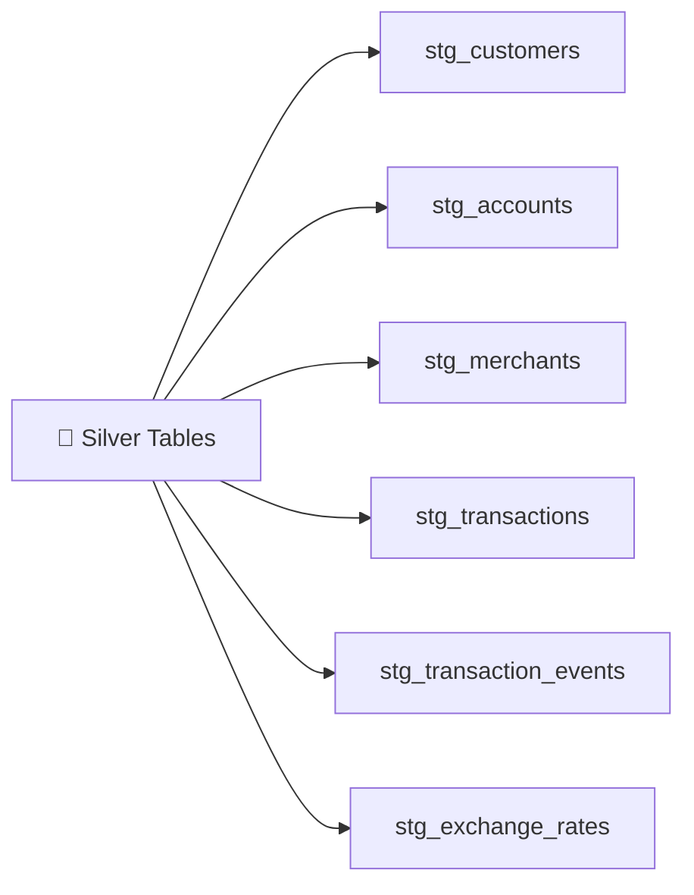

### Responsibilities

- Rename columns
- Standardize data types
- Apply basic transformations
- Establish naming conventions
- Prepare source data
- Create reusable datasets

### Example Models

```text
stg_customers
stg_accounts
stg_merchants
stg_transactions
stg_transaction_events
stg_exchange_rates
```

---

# 🏢 dbt Marts Layer

The dbt Marts layer contains business-oriented analytical models.

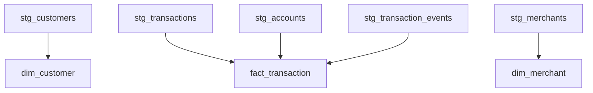

### Responsibilities

- Business-level transformations
- Fact table creation
- Dimension table creation
- Joining staging models
- Creating analytical datasets
- Preparing data for analytics and AI

### Example Models

```text
dim_customer
dim_merchant
fact_transaction
```

---

# 🥇 Gold Layer

The dbt Marts form the business-ready Gold analytical layer.

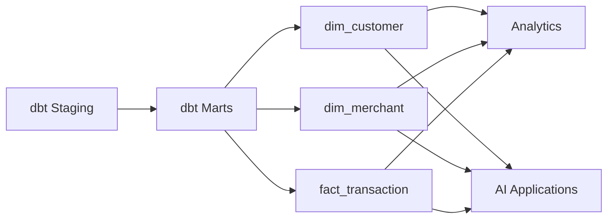

The Gold layer is consumed by:

- Analytics
- Reporting
- Natural Language → SQL
- Data Quality
- Anomaly Detection
- AI Incident Summarizer

---

# 📦 Batch Pipeline

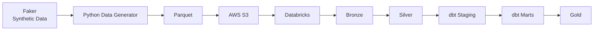

---

# ⚡ Streaming Pipeline

FinStream uses Apache Kafka for transaction streaming.

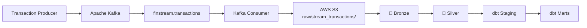

### Kafka Topic

```text
finstream.transactions
```

### S3 Streaming Location

```text
s3://finstream-data-ingestion/raw/stream_transactions/
```

---

# 🔧 dbt Transformation Layer

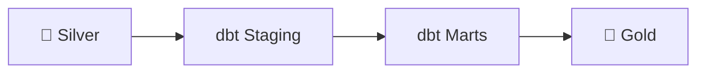

dbt is responsible for:

- SQL transformations
- Staging models
- Marts models
- Gold analytical models
- Jinja templating
- Macros
- Data tests
- Incremental models
- Model dependency management

---

# 🧪 Data Quality

Data-quality checks are performed on the Bronze data before downstream processing.

```mermaid
flowchart LR

    BRONZE["Bronze Data"]

    NULLS["Null Validation"]

    DUPLICATES["Duplicate Validation"]

    SCHEMA["Schema Validation"]

    RELATIONSHIPS["Relationship Validation"]

    BUSINESS["Business Rule Validation"]

    RESULTS["Data Quality Results"]

    BRONZE --> NULLS
    NULLS --> DUPLICATES
    DUPLICATES --> SCHEMA
    SCHEMA --> RELATIONSHIPS
    RELATIONSHIPS --> BUSINESS
    BUSINESS --> RESULTS
```

---

# 🔍 Anomaly Detection

FinStream uses **Isolation Forest** for anomaly detection.

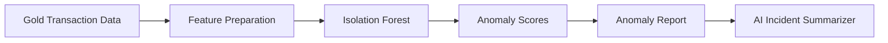

---

# 🤖 AI Architecture

FinStream contains two separate AI layers.

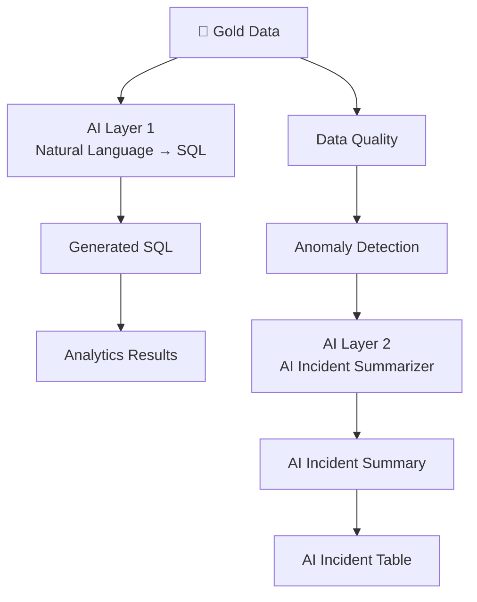

---

# 🧠 AI Layer 1 — Natural Language → SQL

The first AI layer allows users to query financial data using natural language.

### Example

```text
What is the total transaction amount for each transaction type?
```

The AI generates SQL such as:

```sql
SELECT
    transaction_type,
    SUM(amount) AS total_amount
FROM gold.fact_transaction
GROUP BY transaction_type;
```

### Architecture

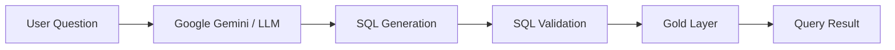

### Capabilities

- Natural Language → SQL
- Schema-aware SQL generation
- LLM-powered analytics
- Self-service analytics
- Business-user friendly data access

---

# 🚨 AI Layer 2 — AI Incident Summarizer

The second AI layer converts anomaly-detection results into human-readable incident summaries.

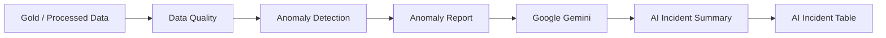

### Incident Information

The generated summary can explain:

- What happened
- Why the record was considered anomalous
- Which records were affected
- Possible business impact
- Relevant transaction context
- Suggested investigation direction

---

# 🗃️ AI Incident Layer

AI-generated incident information is maintained separately from the core Bronze, Silver, and Gold analytical layers.

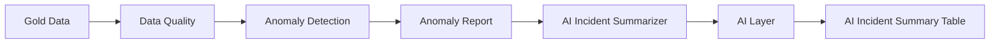

---

# 🔄 Apache Airflow Orchestration

Apache Airflow orchestrates the major pipeline components.

```mermaid
flowchart LR

    AIRFLOW["Apache Airflow"]

    INGESTION["Data Ingestion"]

    BRONZE["Bronze Processing"]

    SILVER["Silver Processing"]

    STAGING["dbt Staging"]

    MARTS["dbt Marts / Gold"]

    QUALITY["Data Quality"]

    ANOMALY["Anomaly Detection"]

    AI["AI Incident Summarizer"]

    AIRFLOW --> INGESTION
    INGESTION --> BRONZE
    BRONZE --> SILVER
    SILVER --> STAGING
    STAGING --> MARTS
    MARTS --> QUALITY
    QUALITY --> ANOMALY
    ANOMALY --> AI
```

### Pipeline Sequence

```text
Data Ingestion
      ↓
Bronze
      ↓
Silver
      ↓
dbt Staging
      ↓
dbt Marts / Gold
      ↓
Data Quality
      ↓
Anomaly Detection
      ↓
AI Incident Summarization
```

---

# 🧱 Databricks

Databricks is the primary data-processing platform.

It is used for:

- AWS S3 ingestion
- Bronze processing
- Silver transformations
- Spark processing
- Streaming processing
- Data preparation
- Analytical queries

Databricks notebooks are version-controlled in GitHub.

---

# 🗂️ Databricks Notebook Structure

```text
Databricks
│
├── bronze_data_ingestion
│       │
│       └── AWS S3 → Bronze
│
├── stream_ingestion
│       │
│       └── Kafka → S3 → Bronze
│
├── bronze_quality
│       │
│       └── Bronze → Data Quality
│
└── silver_transformation
        │
        └── Bronze → Silver
```

---

# 🗄️ Data Sources

FinStream uses synthetic financial data.

| Dataset | Description |
|---|---|
| Customers | Customer master information |
| Accounts | Financial account information |
| Merchants | Merchant information |
| Transactions | Financial transaction records |
| Transaction Events | Transaction lifecycle events |
| Exchange Rates | Currency exchange-rate information |

---

# 💳 Transaction Schema

The transaction dataset contains fields such as:

| Field | Description |
|---|---|
| `transaction_id` | Unique transaction identifier |
| `account_id` | Associated account |
| `merchant_id` | Associated merchant |
| `transaction_timestamp` | Transaction timestamp |
| `transaction_type` | Type of transaction |
| `amount` | Transaction amount |
| `currency` | Transaction currency |
| `transaction_status` | Transaction status |
| `payment_method` | Payment method |
| `description` | Transaction description |

---

# 🛠️ Technology Stack

| Category | Technology |
|---|---|
| Programming | Python |
| Cloud Storage | AWS S3 |
| Data Processing | Databricks / Apache Spark |
| Streaming | Apache Kafka |
| Containerization | Docker / Docker Compose |
| Transformation | dbt |
| Orchestration | Apache Airflow |
| Data Format | Parquet |
| Data Generation | Faker |
| Data Quality | Python / SQL |
| Anomaly Detection | Isolation Forest |
| Generative AI | Google Gemini |
| Version Control | Git / GitHub |
| Configuration | python-dotenv |

---

# 📁 Project Structure

```text
finstream-data-platform/
│
├── src/
│   └── finstream_data_platform/
│       │
│       ├── ingestion/
│       ├── transformation/
│       ├── streaming/
│       ├── quality/
│       └── ai/
│
├── notebooks/
│   ├── bronze_data_ingestion
│   ├── stream_ingestion
│   ├── bronze_quality
│   └── silver_transformation
│
├── dbt/
│   ├── models/
│   │   ├── staging/
│   │   └── marts/
│   │
│   ├── macros/
│   ├── tests/
│   └── dbt_project.yml
│
├── dags/
│   └── finstream_stream_orchestration.py
│
├── Kafka/
│   └── docker-compose.yml
│
├── Data/
│   └── raw/
│
├── tests/
│
├── .env.example
├── .gitignore
├── pyproject.toml
└── README.md
```

---

# 🔐 Security

Sensitive credentials are not stored in GitHub.

Environment variables are used for configuration.

Example:

```text
AWS_ACCESS_KEY_ID=
AWS_SECRET_ACCESS_KEY=
S3_BUCKET_NAME=
DATABRICKS_HOST=
DATABRICKS_TOKEN=
GEMINI_API_KEY=
GEMINI_MODEL=
```

The actual `.env` file must never be committed.

Only `.env.example` should be included in the repository.

---

# 🚀 Getting Started

## 1. Clone the Repository

```bash
git clone <your-github-repository-url>

cd finstream-data-platform
```

---

## 2. Configure Environment Variables

Create a local `.env` file based on:

```text
.env.example
```

Configure:

- AWS credentials
- S3 bucket
- Databricks configuration
- Gemini API configuration

---

## 3. Start Kafka

```bash
cd Kafka
docker compose up -d
```

Check containers:

```bash
docker compose ps
```

---

## 4. Verify Kafka Topic

```bash
docker exec finstream-kafka /opt/kafka/bin/kafka-topics.sh \
    --list \
    --bootstrap-server localhost:9092
```

Expected topic:

```text
finstream.transactions
```

---

# 🔄 Running the Pipeline

The complete pipeline follows:

```text
Batch / Streaming Sources
          ↓
     AWS S3 / Kafka
          ↓
       Databricks
          ↓
        Bronze
          ↓
        Silver
          ↓
     dbt Staging
          ↓
      dbt Marts
          ↓
         Gold
          ↓
    Data Quality
          ↓
  Anomaly Detection
          ↓
AI Incident Summarizer
```

The Natural Language → SQL layer operates on the Gold analytical data.

---

# 📈 Example AI Questions

```text
What is the total transaction amount?
```

```text
What are the most common transaction types?
```

```text
Which merchants have the highest transaction volume?
```

```text
Which customers have the highest transaction value?
```

```text
How many transactions failed?
```

```text
What is the average transaction amount by currency?
```

```text
What are the daily transaction volumes?
```

---

# 🚨 Example Incident Analysis

The anomaly-detection system may identify an unusual transaction pattern.

Example technical output:

```text
transaction_id = XYZ
anomaly_score = -0.82
anomaly = True
```

The AI Incident Summarizer converts this information into a human-readable explanation.

Example:

```text
Incident:
Unusual transaction behavior detected.

Summary:
The transaction deviates from the expected transaction pattern
based on the available transaction features.

Possible Impact:
The transaction may require further investigation.

Recommended Action:
Review the transaction and related account activity.
```

---

# 🎯 Project Objectives

FinStream demonstrates practical knowledge of:

- End-to-end Data Engineering
- Data Lake Architecture
- Medallion Architecture
- Batch Data Pipelines
- Streaming Data Pipelines
- Apache Kafka
- AWS S3
- Databricks
- Apache Spark
- dbt
- dbt Staging
- dbt Marts
- Apache Airflow
- Data Quality Engineering
- Machine Learning
- Isolation Forest
- Generative AI
- Natural Language → SQL
- AI Incident Analysis
- Cloud Data Platforms
- Git and GitHub

---

# 🔮 Future Improvements

Potential future improvements include:

- Real-time anomaly detection directly from Kafka
- Real-time AI incident summarization
- Advanced data-quality monitoring
- Data lineage
- Data observability dashboards
- CI/CD for Databricks and dbt
- Automated pipeline testing
- SQL safety validation for Natural Language → SQL
- Role-based access control
- RAG-based business knowledge
- Pipeline monitoring and alerting
- Infrastructure as Code
- Cloud cost optimization
- Production-grade deployment

---

# 🏆 Final Architecture

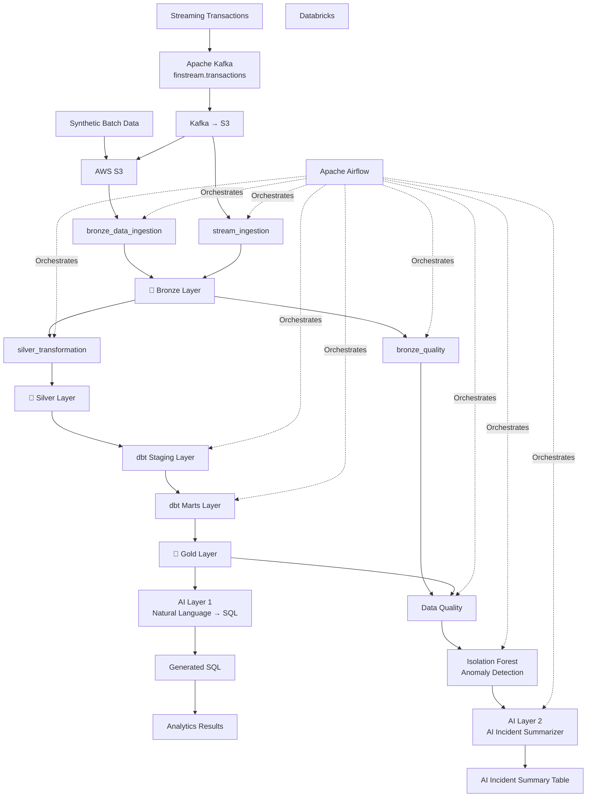

---

# 💡 Key Takeaway

FinStream combines:

```text
Data Engineering
       +
AWS S3
       +
Apache Kafka
       +
Databricks
       +
Bronze / Silver Architecture
       +
dbt Staging
       +
dbt Marts / Gold
       +
Data Quality
       +
Isolation Forest
       +
Generative AI
       +
Apache Airflow
```

into a single end-to-end financial data platform.

The complete journey of financial data is:

```text
Generate
   ↓
Ingest
   ↓
Store
   ↓
Process
   ↓
Bronze
   ↓
Quality Check
   ↓
Silver
   ↓
dbt Staging
   ↓
dbt Marts / Gold
   ↓
Analyze
   ↓
Detect Anomalies
   ↓
Explain Incidents with AI
   ↓
Query Data using Natural Language
```

---

# 👨‍💻 Author

**Harshit**

### FinStream — Financial Data Engineering + AI Platform
